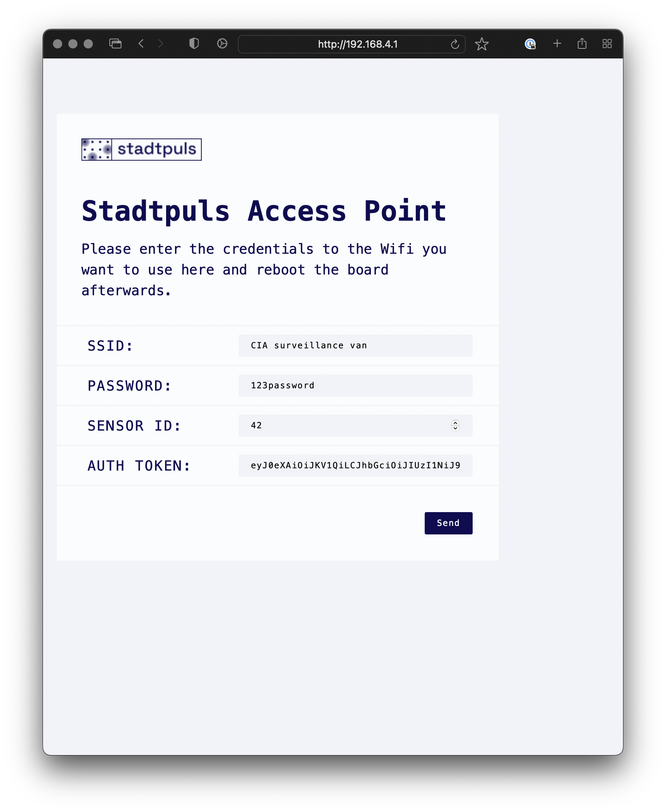
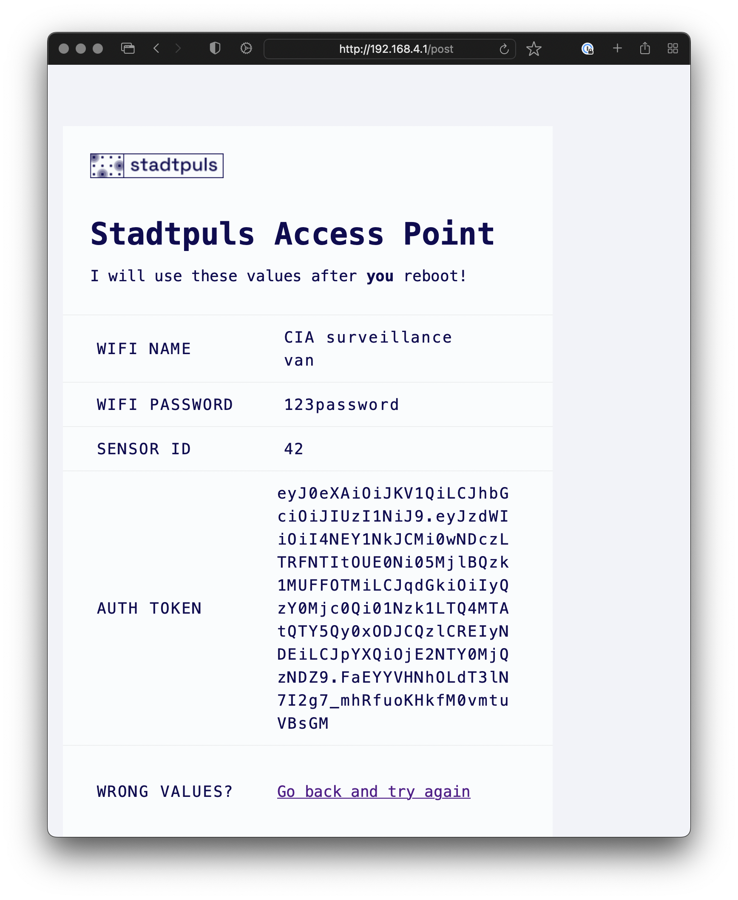

<!-- ALL-CONTRIBUTORS-BADGE:START - Do not remove or modify this section -->
[](#contributors-)
<!-- ALL-CONTRIBUTORS-BADGE:END -->

# Stadtpuls.com ESP32 Assistant

A template repository for ESP32 projects that connect to [stadtpuls.com](https://stadtpuls.com).
## Prerequisites

- [PlatformIO](https://platformio.org/)
- currently only tested on [Heltec ESP32-LoRa-V2](https://heltec.org/project/wifi-lora-32/) we might add other ESP32 flavors in the future. It should work with all ESP32 Boards that have WiFi. 

## Installation

```bash
pio pkg install
```

## Usage and Deployment

Create a new repository from this template by hitting "Use this template" button or going to [this url](https://github.com/technologiestiftung/stadtpuls-esp32-assistant/generate).
Update the code to your liking and add a sensor to your ESP32.


```cpp
#include <Arduino.h>
#include "stadtpuls.h"

// Create the instance of the Stadtpuls lib
Stadtpuls stadtpuls; 
// All options are optional.
// See the struct `Stadtpuls_Options` in stadtpuls.h
Stadtpuls_Options options;         
// keeping track of time
unsigned long previous_millis = 0;
// 60 seconds
unsigned long interval = 60000;

void setup()
{
  // Will be used as the sensor name and for the access point
  options.sensor_name = "Stadtpuls";
  // For some more information in the Serial monitor
  options.debug = true;
  Serial.begin(115200);
  // Setup the stadtpuls instance.
  stadtpuls.begin(options);
}

void loop()
{
  // Listen to changes on the forget pin (currently 33)
  stadtpuls.listen();

  // Stadtpuls.com's api is rate limitied. Still we urge you not to make to many requests.
  // Here use a interval of 60 seconds to send data to stadtpuls.com.
  //---
  // Keeping track of time non blocking - because delay is bad!
  unsigned long current_millis = millis();
  if (current_millis - previous_millis >= interval)
  {
    // stadtpuls.send takes a vector of doubles.
    //You can send as many values as you like.
    // Currently the frontend only displays the first one,
    // but you can optain them all through the API.
    stadtpuls.send(std::vector<double>{1, 2, 3});

    // Set the previous_millis to the current_millis
    // so we can keep track of the interval.
    previous_millis = current_millis;
  }
}
```

To get this onto your board you need to run the following commands (with [platformio CLI](https://docs.platformio.org/en/latest/core/) installed). 

```bash
# copy the content of the data folder to the board
pio run --target uploadfs
# compile the code and upload it to the board
pio run --target upload
# monitor the boards serial output
pio device monitor -b115200
```

When first started and `options.ssid` and `options.password` are not specified or wrong the ESP will start an open access point with the name specified in `options.sensor_name` (default is `Stadtpuls`). Connect to that WiFi and go to [http://192.168.4.1](http://192.168.4.1).There you can set the SSID and password, your sensors id and your auth token. The id will be used to identify your sensor and the auth token to authenticate your sensor. You need to create a new sensor and token in your stadtpuls.com account beforehand.




After you entered and submitted your credentials you need to restart the ESP by pressing the RST button on the board.

If everything is right your ESP should be able to join your network and send data to stadtpuls.com. Watch the serial output of the ESP to see if it is sending data.

If you need delete the WiFi and stadtpuls.com credentials you can connect the VCC to the `forget_pin` (currently 33) and the ESP will delete the credentials.


## Tests

No tests yet. :(
## Contributing

Please open an issue before creating a pull request. We will add some issues with the tag `good first issue` to mark the things that need to be done. 
## Contributors

Thanks goes to these wonderful people ([emoji key](https://allcontributors.org/docs/en/emoji-key)):

<!-- ALL-CONTRIBUTORS-LIST:START - Do not remove or modify this section -->
<!-- prettier-ignore-start -->
<!-- markdownlint-disable -->
<table>
  <tr>
    <td align="center"><a href="https://fabianmoronzirfas.me/"><br /><sub><b>Fabian Morón Zirfas</b></sub></a><br /><a href="https://github.com/technologiestiftung/template-default/commits?author=ff6347" title="Documentation">📖</a></td>
    <td align="center"><a href="http://vogelino.com"><br /><sub><b>Lucas Vogel</b></sub></a><br /><a href="https://github.com/technologiestiftung/template-default/commits?author=vogelino" title="Documentation">📖</a> <a href="#ideas-vogelino" title="Ideas, Planning, & Feedback">🤔</a> <a href="https://github.com/technologiestiftung/template-default/pulls?q=is%3Apr+reviewed-by%3Avogelino" title="Reviewed Pull Requests">👀</a> <a href="https://github.com/technologiestiftung/template-default/commits?author=vogelino" title="Code">💻</a></td>
    <td align="center"><a href="http://www.awsm.de"><br /><sub><b>Ingo Hinterding</b></sub></a><br /><a href="https://github.com/technologiestiftung/template-default/commits?author=Esshahn" title="Documentation">📖</a></td>
  </tr>
</table>

<!-- markdownlint-restore -->
<!-- prettier-ignore-end -->

<!-- ALL-CONTRIBUTORS-LIST:END -->

This project follows the [all-contributors](https://github.com/all-contributors/all-contributors) specification. Contributions of any kind welcome!


## Credits

<table>
  <tr>
    <td>
      Made by <a src="https://citylab-berlin.org/de/start/">
        <br />
        <br />
        
      </a>
    </td>
    <td>
      A project by <a src="https://www.technologiestiftung-berlin.de/">
        <br />
        <br />
        
      </a>
    </td>
    <td>
      Supported by <a src="https://www.berlin.de/rbmskzl/">
        <br />
        <br />
        
      </a>
    </td>
  </tr>
</table>

## Related Projects
